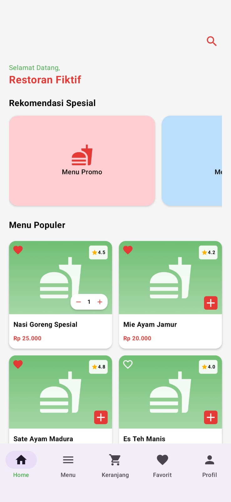
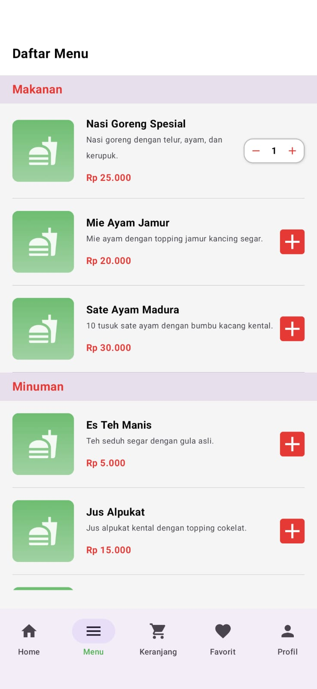
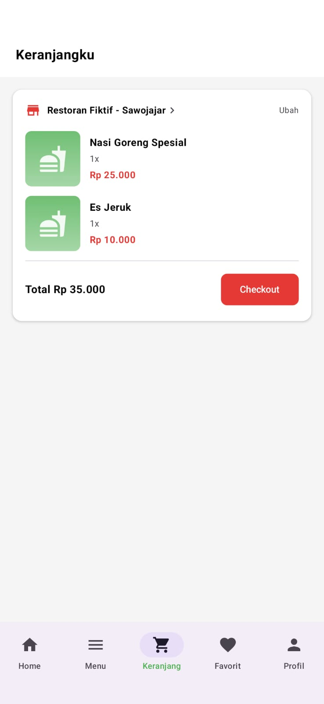
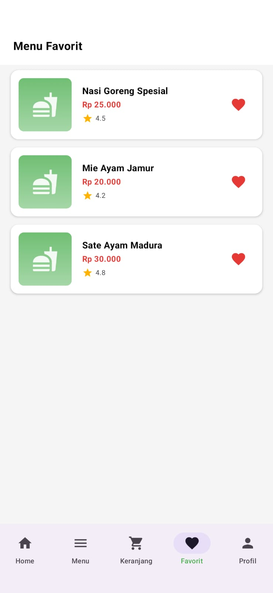
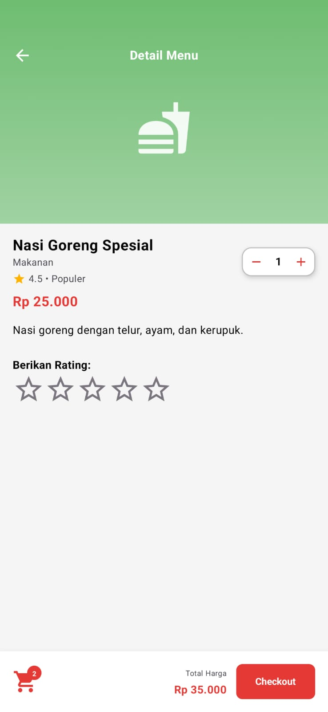
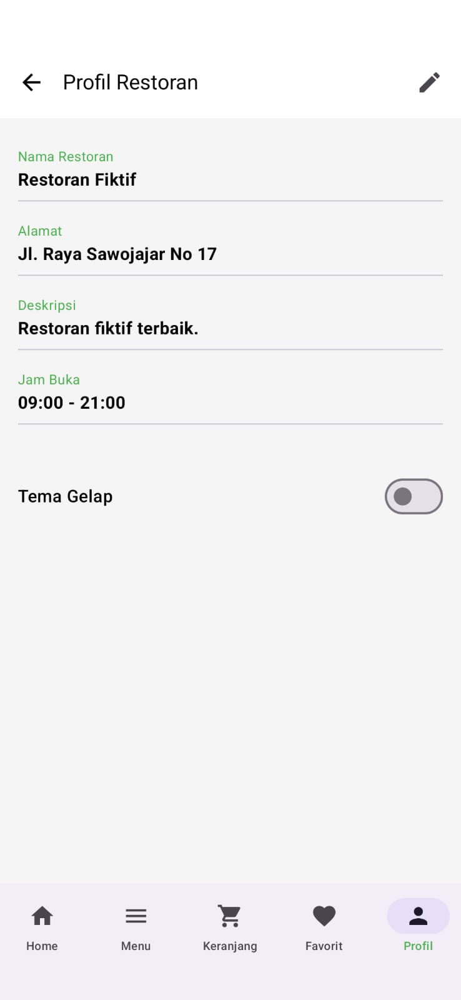
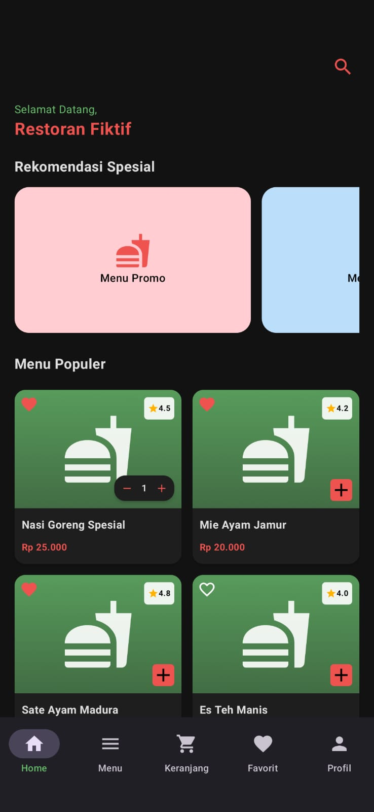

# Restoran Fiktif - Android App 🍔🍹

[](https://developer.android.com)
[](https://kotlinlang.org)

**Restoran Fiktif** adalah aplikasi pemesanan makanan berbasis Android yang dirancang dengan antarmuka yang modern, bersih, dan interaktif. Aplikasi ini menggunakan Jetpack Compose untuk menyusun UI-nya secara deklaratif, mencakup navigasi antar-halaman yang mulus, serta mendukung fitur perpindahan tema.

---

## 📱 Fitur Utama

* **Home & Rekomendasi:** Halaman utama yang menampilkan menu promo spesial dalam bentuk *carousel/slider* serta daftar menu populer lengkap dengan rating.
* **Daftar Menu Terkategori:** Pengelompokan menu yang rapi berdasarkan kategori (Makanan, Minuman, dll) untuk memudahkan navigasi pengguna.
* **Sistem Keranjang Interaktif:** Pengguna dapat menambah, mengurangi jumlah pesanan secara *real-time*, melihat total biaya belanjaan, dan melakukan simulasi *checkout* melalui halaman khusus maupun *bottom sheet*.
* **Menu Favorit:** Fitur *bookmarking* (ikon hati) untuk menyimpan makanan atau minuman kesukaan pengguna ke dalam daftar tersendiri.
* **Detail Menu & Rating:** Halaman khusus untuk melihat deskripsi lengkap item, ulasan/rating bintang, dan memodifikasi jumlah pesanan sebelum dimasukkan ke keranjang.
* **Profil Restoran & Fitur Tema:** Informasi detail mengenai restoran (alamat, deskripsi, jam buka) serta dilengkapi fitur **Dark Mode (Tema Gelap)** untuk kenyamanan visual pengguna.

---

## 📸 Dokumentasi / Screenshot

| Halaman Utama (Light) | Daftar Menu | Keranjang Belanja |
| :---: | :---: | :---: |
|  |  |  |

| Menu Favorit | Detail Menu & Rating | Profil Restoran |
| :---: | :---: | :---: |
|  |  |  |

| Halaman Utama (Dark) |
| :---: |
|  |

---

## 🛠️ Teknologi & Arsitektur yang Digunakan

* **Bahasa Pemrograman:** [Kotlin](https://kotlinlang.org/)
* **Desain UI:** Jetpack Compose (Modern Toolkit untuk UI Android)
* **Komponen & Library:**
    * `Material Design 3 (M3)` untuk komponen visual (Card, Bottom Bar, Switch, TopAppBar).
    * `Navigation Component for Compose` untuk mengelola navigasi halaman.
    * State Management menggunakan bahaasan internal Compose (`mutableStateOf`).

---

## 🚀 Cara Menjalankan Project

1.  **Clone Repositori Ini:**
    ```bash
    git clone [https://github.com/aangmaulana57/Restoran_Fiktif.git](https://github.com/aangmaulana57/Restoran_Fiktif.git)
    ```
2.  **Buka di Android Studio:**
    * Buka Android Studio, pilih **File > Open**, lalu arahkan ke folder hasil clone.
3.  **Sync Gradle:**
    * Tunggu proses *Gradle Sync* selesai hingga seluruh dependensi terunduh dengan benar.
4.  **Jalankan Aplikasi:**
    * Hubungkan perangkat Android fisik atau gunakan Emulator, lalu klik tombol **Run (`Shift + F10`)**.

---
